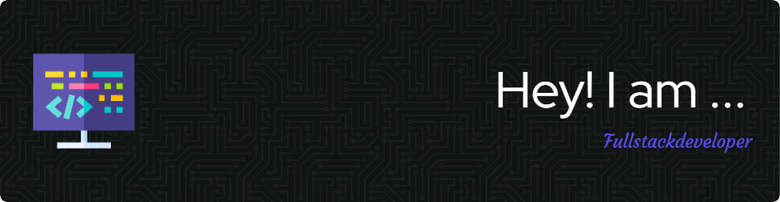

<h1 align="center">Hi 👋, I'm Arihant Chougule</h1>
<h3 align="center">Crafting Seamless Web Experiences with Code & Creativity</h3>

  
  <!-- Text on the left -->
  

    <h1 style="font-size: 40px; margin: 0;">💫 About Me</h1>
    <ul style="margin: 0; padding: 0; list-style-position: inside;">
      <li>✨ Currently working on web projects</li>
      <li>🤟 Open to collaborating on <b>Web Development</b> projects</li>
      <li>🌐 Exploring <b>Next.js</b> and <b>TypeScript</b> for better performance and scalability</li>
      <li>🔍 Ask me about <b>Frontend Development</b>, <b>Optimizing Web Performance</b></li>
      <li>⚡ Fun fact - <b>I believed <code>console.log()</code> was the ultimate debugger — until I met <code>console.error()</code>.</b></li>
    </ul>
  

  <!-- Image on the right -->
  

    
  

## 🌐 Socials:
   

# 💻 Tech Stack:
                           
# 📊 GitHub Stats:
 
 

## 🏆 GitHub Trophies

---

<!-- Proudly created with GPRM ( https://gprm.itsvg.in ) -->

this my github README file i am facing issues related to about me section in that image not flex to text and text are pyramid make them text as left and image as right in same row
